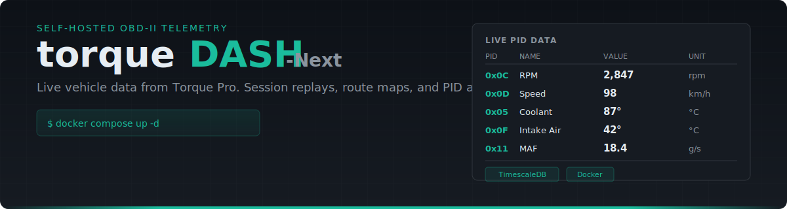
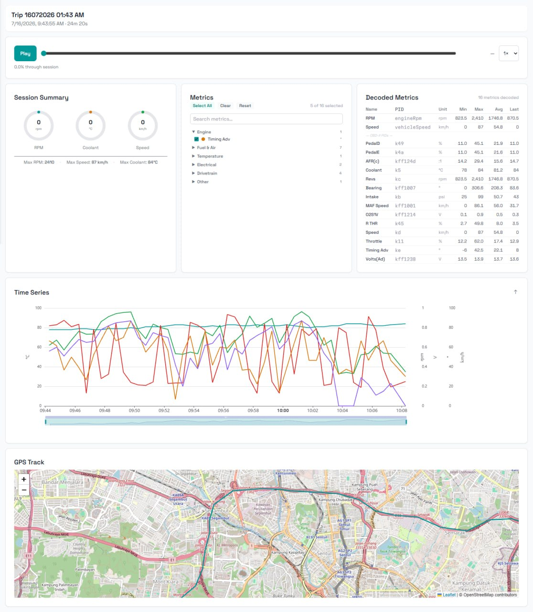

# torqueDASH-Next

<p align="center">
  
</p>

<p align="center">
  
</p>

A self-hosted dashboard for [Torque Pro](https://torque-bhp.com/) vehicle telemetry. Torque Pro streams live OBD-II data from your car over HTTPS; torqueDASH-Next stores it in a time-series database and renders it in a React dashboard — live gauges, a route map, session replays, and per-session summaries. All data stays on your own server.

## How it works

| Layer | Stack |
|-------|-------|
| Backend | Node.js + Express 4, Sequelize 6, PostgreSQL / TimescaleDB |
| Frontend | React 18 + Vite + TypeScript, ECharts, Leaflet |
| Deploy | Docker Compose: `db` (TimescaleDB) + `backend` + `frontend` (nginx) |

## Quick start

```bash
# Download the production files
curl -O https://raw.githubusercontent.com/moesix/torque-dash-next/master/docker-compose.prod.yml
curl -O https://raw.githubusercontent.com/moesix/torque-dash-next/master/.env.example

# Create your .env and edit with your settings
cp .env.example .env
nano .env

# Start the stack
docker compose -f docker-compose.prod.yml up -d
```

Then open **http://localhost:8080**.

> The app **will not start** without `DATABASE_URL` and `SESSION_KEYS`. Generate them with `openssl rand -base64 24` and `openssl rand -hex 24` respectively. See the full config reference below.

## Connect Torque Pro

In Torque Pro → *Settings → Web Preferences*:

| Setting | Value |
|---------|-------|
| Server URL | `https://<your-host>/api/upload` |
| Email address | The email you registered with |
| Broadcast as HTTP | Header: `Authorization: bearer <UPLOAD_API_TOKEN>` |

After creating all user accounts, disable public registration via the Settings UI or set `DISABLE_REGISTRATION=true` in your `.env` file.

## Features

- **Dashboard & visualization** — Live vehicle gauges (RPM, Coolant, Speed), a multi-series PID overlay chart with toggleable metrics and collapsible stats, a route map with color-coded speed traces, and session replays with a playback cursor that drives the gauges in real time. Session summary cards with live SVG ring gauges update as playback progresses.

- **Data ingestion** — Email-gated uploads from Torque Pro over HTTPS. Optional Bearer token authentication for an additional security layer — generate from the Settings UI or set via `UPLOAD_API_TOKEN`. Rate-limited upload endpoint with configurable thresholds.

- **Deployment** — Docker-first: one `docker compose up -d` and you're running. PostgreSQL/TimescaleDB, Node.js backend, and nginx frontend all orchestrated via Compose. Non-root container users, unprivileged nginx.

- **Session management** — Sessions auto-name as `Trip DDMMYYYY HH:MM AM/PM` on first upload. Rename inline from the session table with pencil-icon editing (Enter/Escape/blur handling).

- **PID decode engine** — Auto-discovers all OBD-II parameters from Torque's JSONB `values` column using embedded metadata and a curated fallback map. No schema changes needed for new PIDs. Renders per-unit group axes on the chart.

## Configuration

<details>
<summary>Full environment variables reference</summary>

| Variable | Default | Description |
|----------|---------|-------------|
| `DATABASE_URL` | **REQUIRED** | PostgreSQL/TimescaleDB connection string. App crashes on startup if missing. |
| `POSTGRES_PASSWORD` | **REQUIRED** | Database password for Docker deployments. Generate with `openssl rand -base64 24`. |
| `SESSION_KEYS` | **REQUIRED** | Comma-separated express-session secrets. App crashes on startup if missing. |
| `PORT` | `3000` | Backend HTTP port. |
| `NODE_ENV` | _(unset)_ | Set to `production` to skip `sequelize.sync()` (use migrations instead). |
| `COOKIE_SECURE` | `false` | `true` to set `Secure` on session cookies (requires HTTPS). |
| `COOKIE_SAMESITE` | `lax` | `SameSite` policy for session cookies. |
| `CORS_ORIGINS` | _(empty)_ | Comma-separated allowed origins for cross-origin API access. Also serves as the CSRF trust list. |
| `PUBLIC_ORIGIN` | _(unset)_ | Overrides the expected CSRF origin. Set when nginx terminates HTTPS but forwards HTTP to the backend. |
| `UPLOAD_API_TOKEN` | _(unset)_ | If set, uploads require `Authorization: Bearer <token>`. Can also be generated from the Settings UI. |
| `UPLOAD_RATE_LIMIT_MAX` | `600` | Max uploads per window per IP. |
| `UPLOAD_RATE_LIMIT_WINDOW_MS` | `60000` | Upload rate-limit window in milliseconds. |
| `AUTH_RATE_LIMIT_MAX` | `10` | Max login/register requests per window per IP. |
| `AUTH_RATE_LIMIT_WINDOW_MS` | `60000` | Auth rate-limit window in milliseconds. |
| `WRITE_RATE_LIMIT_MAX` | `30` | Max authenticated mutations per window per IP. |
| `WRITE_RATE_LIMIT_WINDOW_MS` | `60000` | Write rate-limit window in milliseconds. |
| `READ_RATE_LIMIT_MAX` | `600` | Max requests to all other `/api` routes per window per IP. |
| `READ_RATE_LIMIT_WINDOW_MS` | `60000` | Global `/api` rate-limit window in milliseconds. |
| `DISABLE_REGISTRATION` | _(unset)_ | If `true`, public sign-up is disabled. |

For detailed deployment instructions, troubleshooting, and reverse proxy setup, see [docs/deployment.md](docs/deployment.md).

</details>

## Security

**Upload authentication:** When `UPLOAD_API_TOKEN` is set, all uploads must include `Authorization: Bearer <token>`. Email alone is no longer sufficient. If upgrading, add your token in Torque Pro → *Settings → Advanced → HTTP Auth Token*.

**Password changes:** Users can change their password via `POST /api/users/change-password`. This validates the current password, enforces a minimum length of 8 characters, and invalidates all other sessions. Bcrypt salt factor is 10.

**Registration control:** After creating accounts, disable public sign-up via the Settings UI toggle or `DISABLE_REGISTRATION=true`.

## License

MIT — see [LICENSE](./LICENSE). This project is a modernization of, and is grateful for, the original [torque-dash](https://github.com/davekrejci/torque-dash) by David Krejci. Attribution is recorded in [NOTICE](./NOTICE).
