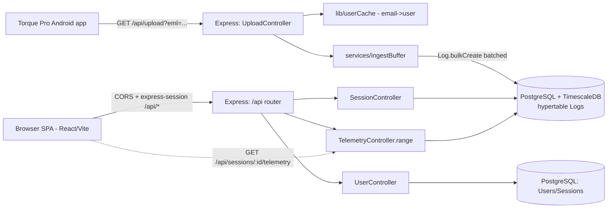

# torqueDASH-Next — System Architecture

This document describes the architecture of the Tier-2 modernization of
`torque-dash`. It covers the high-level topology, backend internals, frontend
internals, the synchronized-replay data flow, and the (currently conceptual)
containerisation topology.

---

## 1. High-Level Topology

Two clients talk to the same Express backend:

1. **Torque Pro** (Android) — pushes OBD2 frames to an unauthenticated,
   *email-gated* ingestion endpoint.
2. **Browser SPA** (React/Vite) — reads data over an authenticated, CORS +
    cookie-based session API (express-session + connect-pg-simple store).



```
                          ┌─────────────────────────────────────────┐
   Torque Pro  ──GET────▶ │  Express (app.js)                        │
   /api/upload            │   ├─ UploadController.processUpload       │
   (email-gated +        │   │    ├─ lib/userCache (positive+neg)     │
    Bearer token req'd)  │   │    ├─ services/ingestBuffer           │──▶  PostgreSQL
                          │   │    │     └─ Log.bulkCreate (batched)  │      + TimescaleDB
   Browser SPA  ──/api──▶ │   │    └─ lib/ssrfGuard (forwardUrls)     │      hypertable Logs
    CORS + express-session  │   ├─ SessionController (list/metadata)    │
                          │   ├─ TelemetryController.range (paged)    │
                          │   └─ UserController (auth/forwardUrls)    │
                          └─────────────────────────────────────────┘
```

### Ingest path
`Torque Pro` → `GET /api/upload` → `UploadController.processUpload` →
resolve user (cached) → `findOrCreate` session (resolved numeric FK) →
`ingestBuffer.ingest()` → buffered `Log.bulkCreate` → `200 OK`.

`forwardUrls` fan-out is fire-and-forget (`setImmediate`), SSRF-guarded, native
`fetch` with a 3s `AbortController` timeout.

### Read path
`Browser SPA` → `CORS` + `express-session` → `/api/*` → `authenticate`
middleware → controller. Telemetry is served via
`GET /api/sessions/:id/telemetry?from&to&limit` (`TelemetryController.range`),
which enforces ownership (or `?shareId=` for shared sessions) and returns
**paged** frames from the `Logs` hypertable.

---

## 2. Backend Internals

### 2.1 `UploadController` (`controllers/UploadController.js`)
- **Email-gated:** resolves the `eml` query param to a `User` via
  `lib/userCache` (positive **and** negative TTL cache, 300s). Unknown emails
  get `403` and are **never buffered or forwarded**.
- **Resolved numeric FKs:** `Session.findOrCreate` caches `user.id` /
  `session.id`; only numeric FKs (plus the raw frame) are pushed into the buffer
  — never emails.
- **GPS:** `kff1005` = lon, `kff1006` = lat. Non-GPS uploads are stored with
  null lat/lon (no longer dropped).
- **Promoted columns:** `engineRpm` ← `values.kc` (PID 0x0C), `vehicleSpeed` ← `values.kd` (PID 0x0D). Torque stores hex keys **without leading zeros**, so the key is `kc`, not `k0c`. Values are extracted with a zero‑safe pattern: `values.kc != null ? Number(values.kc) : null` (preserves legitimate `0` values).
- **Auto-naming:** new sessions are automatically named `Trip DDMMYYYY h:mmA`
  (12-hour clock with AM/PM) using `Date` arithmetic adjusted by the user's
  `timezoneOffset` from the `Settings` singleton (stored in minutes, e.g. `480`
  for UTC+8). The `moment` dependency previously used here has been removed.
- **Vehicle resolution (`v` param):** Torque Pro's optional `v` query param
  (vehicle profile name) is matched to a `Vehicle` record by name and userId.
  When `v` is absent or no match is found, the controller falls back to the
  user's default vehicle (`isDefault: true`). The resolved `vehicleId` is stored
  on the `Session` and returned in session metadata.
- **SSRF-guarded `forwardUrls`:** each URL is checked with `lib/ssrfGuard.isSafeUrl`
  before a fire-and-forget `fetch`.
- Responds `200 OK` immediately; the DB flush is asynchronous.

### 2.2 `ingestBuffer` (`services/ingestBuffer.js`)
- In-memory array flushed to `Log.bulkCreate(rows, { ignoreDuplicates: true })`
  when the buffer reaches `BATCH_SIZE = 1000` rows **or** every `FLUSH_MS = 1000`
  via an unref'd timer.
- Buffer stores only resolved numeric FKs + frame data.
- **Failure semantics:** a failed flush re-queues the batch (with an attempt
  counter) up to `MAX_RETRIES = 3`, after which rows are dropped and an error is
  logged. This bounds memory at the cost of possible telemetry loss on a
  persistently failing DB.
- **Buffer cap:** the live buffer is hard-capped at `MAX_BUFFER_SIZE = 50000`
  rows. If the buffer exceeds the cap the oldest rows are dropped (backpressure).
- **Flush mutex:** a `flushing` boolean prevents concurrent flush executions,
  eliminating the race condition where a re-queued failed batch could be flushed
  simultaneously with a fresh batch.

### 2.3 `TelemetryController.range` (`controllers/TelemetryController.js`)
- `GET /api/sessions/:id/telemetry?from&to&limit[&shareId]`.
- Enforces ownership (`req.user.id`) or shared access (`?shareId=`).
- `Log.findAll` with `timestamp BETWEEN from AND to`, capped `limit`
  (`min(limit||5000, 10000)`), ordered ASC, **limited attributes**
  (`timestamp, lon, lat, values, engine_rpm, vehicle_speed`).
- Returns JSON frames (unlike the legacy `getOne`/`getAll` which eager-load
  the full `Log` array). Session list endpoints use `aggregateSummaries()`
  (one `GROUP BY` per request) instead of including full log associations —
  eliminating the N+1 query pattern that previously flooded telemetry queries.

### 2.4 TimescaleDB (`infra/timescale/log_hypertable.sql`)
- **Hypertable** `Logs` partitioned by `timestamp` (`chunk_time_interval = 1 day`).
- **PK restructured** to `("sessionId", timestamp)` (required by TimescaleDB);
  `id` kept globally unique via a unique index for id-based `filter`/`cut`/`join`
  operations.
- **Promoted columns** `engine_rpm` (double precision) and `vehicle_speed`
  (double precision) for hot-path queries.
- **Index** `logs_session_time_idx ON "Logs"("sessionId", timestamp DESC)`.
- **Compression** — enabled on the hypertable, segmenting by `sessionId` and
  ordering by `timestamp DESC`. A compression policy auto-compresses chunks
  older than 7 days (`add_compression_policy('"Logs"', INTERVAL '7 days')`).
  The migration temporarily disables compression during ALTER TABLE operations
  (TimescaleDB does not support ALTER on compressed hypertables).
- **Continuous aggregate** `log_1min` (1-minute buckets of avg/max rpm & speed,
  count) with a refresh policy. Currently **unused** by the API (Known Issues, LOW).

> Columns are **camelCase** (`sessionId`, `engine_rpm`) because no
> `underscore: true` is set; the SQL uses quoted identifiers accordingly.

### 2.5 `TelemetryController.exportCsv` (`controllers/TelemetryController.js`)
- `GET /api/sessions/:sessionId/export/csv` — authenticated (cookie + owner), streams
  all telemetry frames for a session as a CSV download.
- **Dynamic column discovery** — reads the `values` JSONB from each frame and
  auto-discovers all unique PID keys across the session's data. Each PID becomes
  a column header (resolved to its human-readable display name and unit via
  `pidDecode.ts`). Timestamp, GPS coordinates, engine RPM, and vehicle speed are
  promoted as fixed columns.
- **Streaming response** — the entire response is streamed as `text/csv` with
  `Content-Disposition: attachment`, so even large sessions don't exhaust server
  memory. CSV is written row-by-row using a lightweight streaming approach
  instead of buffering the full result set.
- **Frontend trigger** — a "↓ CSV" button in the `ReplayDashboard` header calls
  this endpoint, prompting a file download in the browser.
- Returns `404` if the session doesn't exist or doesn't belong to the user.

---

### 2.6 `lib/pidRegistry.js` — Unified PID Metadata

- **Shared metadata source** — `lib/pidRegistry.js` holds the canonical PID
  metadata (fullName, shortName, unit) for all known OBD-II PIDs. It replaces
  the previous hardcoded `PID_NAME_MAP` in `lib/llmPrompt.js`.
- **Backend usage** — `lib/llmPrompt.js` imports `PID_REGISTRY` to resolve
  human-readable names in AI analysis prompts and telemetry CSV context.
- **Frontend sync** — the frontend's `lib/pidDecode.ts` maintains its own
  `FALLBACK_MAP` with the same keys. The comment at the top of `pidDecode.ts`
  instructs developers to update `pidRegistry.js` first, then sync the frontend
  copy.
- **Key format** — Torque hex keys **without leading zeros** (e.g. `k5`, `kc`,
  `kd`, `kf`, `kff1007`). No entries use zero-padded variants.

### 2.7 Security Headers (Helmet)

- **Helmet middleware** (`app.js`) applies a standard set of HTTP security headers
  to all responses: `X-Content-Type-Options: nosniff`, `X-Frame-Options:
  SAMEORIGIN`, `X-XSS-Protection: 0` (modern browsers ignore this, but it's kept
  for safety), `Strict-Transport-Security` (set at the nginx layer), and others.
- **CSP disabled** — `contentSecurityPolicy: false` is passed to Helmet because
  the React SPA relies on inline scripts and styles. A future plan should enable
  CSP via nonces or hashes.
- **nginx HSTS** — the frontend nginx config (`apps/frontend/nginx.conf`) adds
  `Strict-Transport-Security: max-age=31536000; includeSubDomains` to enforce
  HTTPS for one year.

### 2.8 Session Notes

- **Schema:** a nullable `notes` TEXT column on the `Sessions` table, added by
  migration `infra/timescale/008_add_session_notes.sql`.
- **API:** `PATCH /api/sessions/notes/:sessionId` accepts `{ notes: string|null }`
  and updates the session's freeform notes field. Only the session owner may
  update notes.
- **Frontend:** the `ReplayDashboard` renders a `<textarea>` for session notes
  with auto-save on blur. A `Saving...` indicator shows during the async save.
  The notes are synced from the session query data when the page loads.
- **Contract:** notes are returned as part of the session metadata in
  `GET /api/sessions/:id` and `GET /api/sessions` (included in `notes` field).

### 2.9 Vehicle Model

- **Purpose:** the `Vehicle` model (Sequelize, `models/Vehicle.js`) lets users
  define named vehicle profiles (make, model, year, engine displacement) and
  assign sessions to them. This replaces the earlier approach of storing vehicle
  fields in `Settings` — the legacy Settings vehicle fields remain for backward
  compatibility.

- **Schema (`infra/timescale/009_add_vehicles.sql`):**
  - `Vehicles` table: `id` (PK), `name` (VARCHAR 255, NOT NULL, default
    `'My Vehicle'`), `make` (TEXT), `model` (TEXT), `year` (INTEGER),
    `engineCc` (INTEGER), `isDefault` (BOOLEAN, NOT NULL, default false),
    `userId` (FK → `Users.id`, ON DELETE CASCADE), `createdAt`, `updatedAt`.
  - `Sessions.vehicleId` — nullable FK (`Vehicles.id`, ON DELETE SET NULL),
    added by migration 009.
  - Indexes on `Sessions(vehicleId)` and `Vehicles(userId)` for fast lookups.

- **Associations:**
  - `Vehicle.belongsTo(User)` via `userId`.
  - `Vehicle.hasMany(Session)` via `vehicleId` (ON DELETE SET NULL).
  - `Session.belongsTo(Vehicle)` returns `vehicleId` and resolved `vehicleName`
    in session metadata. Both `GET /api/sessions/:id` and `GET /api/sessions`
    include the `Vehicle` association.

- **Upload path integration:** `UploadController` resolves Torque Pro's `v` query
  param to a `Vehicle` by name, falling back to the user's default vehicle.
  The resolved `vehicleId` is stored on `findOrCreate` of the session.

- **Frontend:**
  - `VehicleManager` (in Settings, `features/settings/VehicleManager.tsx`) —
    full CRUD UI for vehicle profiles: add, edit, delete, set default. Replaces
    the old `VehicleCard` component.
  - Vehicle filter in `SessionBrowser` — a `<select>` dropdown filters the
    session list by vehicle (`All vehicles`, specific vehicle, or `Unassigned`).
  - Vehicle column in `SessionTable` — displays `vehicleName` or `(Unassigned)`.
  - `VehicleReassignDialog` (in ReplayDashboard) — native `<dialog>` that lets
    users reassign a session to a different vehicle or unassign it.

### 2.10 `lib/llmPrompt.js` — AI Analysis Prompt Builder

The AI analysis prompt is assembled in `lib/llmPrompt.js`, which exports five
functions used by `controllers/AnalysisController.js` to build the LLM prompt
from session telemetry:

- **`buildContext(session, settings, telemetrySample, pidKeys)`** — Generates the
  vehicle/session context block (vehicle make/model/year, engine displacement,
  session name, location, duration, data point count, discovered PID keys).
- **`computeSummaryStats(telemetrySample, pidKeys)`** — Pre-computes min, max,
  mean, and median for every numeric PID across the full telemetry sample.
  Also computes Combined Fuel Trim (STFT + LTFT) per-row to prevent index
  misalignment from dropped packets. Filters null/empty values before `Number()`
  conversion to avoid data corruption (`Number(null) === 0`).
- **`resampleTelemetry(telemetrySample, maxRows = 80)`** — Uniformly resamples
  telemetry across the full timeline rather than taking a head/tail slice.
  Ensures the LLM receives data from the start, middle cruising phase, and end
  of every drive.
- **`buildTelemetryCsv(telemetrySample, pidKeys)`** — Outputs raw CSV instead of
  Markdown tables, saving ~30% on LLM tokens. Strips lat/lon columns and
  extracts `HH:mm:ss` from timestamps via regex. Uses `resampleTelemetry()`
  internally.
- **`buildAnalysisPrompt(session, settings, telemetrySample, pidKeys)`** —
  Assembles the full analysis prompt by composing all of the above. Includes
  pre-calculated statistical aggregates with units, four diagnostic guardrails
  (fuel trim physics, A/C idle behaviour, ECU torque management, deceleration
  fuel cut-off), dynamic engine size injection, and five specific analysis
  categories.

**Key architectural decisions:**

- **Statistics computed in JS, not by the LLM.** Summary statistics are
  pre-computed server-side so the LLM works from exact values rather than having
  to estimate from sampled rows. This eliminates hallucinated min/max figures.
- **Diagnostic guardrails encoded in the prompt.** Domain-specific rules (e.g.
  "combined fuel trim within ±10% is normal closed-loop operation") prevent the
  LLM from over-diagnosing standard OBD-II operating quirks as mechanical faults.
- **Uniform resampling.** The resampler picks evenly-spaced rows across the
  entire timeline, ensuring the LLM sees data from every phase of the drive
  rather than just the start and end.
- **CSV over Markdown.** CSV is more token-efficient than Markdown tables for
  the same telemetry data, reducing per-analysis cost.

### 2.11 `lib/llmProviders.js` — LLM Provider Routing & Token Budget

- **Provider registry** — `PROVIDERS` maps `openai`, `anthropic`, `ollama`,
  `deepseek`, and `custom` to display names, model lists, and default models.
  The frontend `PROVIDERS` constant in `AiProviderCard.tsx` mirrors this list
  exactly (verified in Plan 043 — no drift).
- **Dispatch (`analyze()`)** — routes by `settings.llmProvider`: OpenAI /
  Ollama / Custom → `analyzeOpenAICompatible` (OpenAI-compatible
  `/chat/completions`), DeepSeek → `analyzeOpenAICompatible` with an
  `extraBody` carrying DeepSeek's `thinking` / `reasoning_effort` fields,
  Anthropic → `analyzeAnthropic` (Messages API). Custom endpoints are
  SSRF-checked via `lib/ssrfGuard` before any request (localhost/127.0.0.1 is
  allowed for Ollama).
- **Configurable token budget** — `max_tokens` is no longer hardcoded. Every
  provider resolves it as `options.maxTokens || settings.llmMaxTokens || 16384`:
  an explicit caller option wins, then the `llmMaxTokens` setting (Settings
  singleton, migration 010, default 16384, validated range 2048–32768), then
  the 16384 fallback. `AnalysisController.testConnection` passes
  `maxTokens: 20` so connection probes stay cheap, while production analyses
  use the configured budget. This replaces the previous hardcoded 8192 that
  starved DeepSeek thinking-mode responses (reasoning + content share one
  budget).
- **API keys** — stored encrypted at rest (`llmApiKeyEnc`, AES-256-GCM via
  `lib/encryption.js`); `getApiKey()` decrypts on demand, `prepareApiKey()`
  encrypts on save.

### 2.12 Data Retention Policy (Plan 046)

The `Logs` hypertable grows unboundedly, so the Settings singleton exposes a
configurable TimescaleDB retention policy for automatic cleanup:

- **Settings fields** — added by migration `infra/timescale/011_add_retention_settings.sql`:
  - `retentionEnabled` BOOLEAN NOT NULL default **false** (opt-in — off by
    default, all data retained indefinitely).
  - `retentionDays` INTEGER NOT NULL default **365**, validated range **90–365**.
  - Both fields are exposed in `GET /api/settings` (defaulting to `false`/`365`
    via `??` fallbacks) and mirrored in `models/Settings.js` + the singleton
    defaults.
- **`PUT /api/settings` validation** — `UserController.updateSettings` rejects
  non-boolean `retentionEnabled` and non-integer `retentionDays` with `400`
  (`retentionEnabled must be a boolean.` / `retentionDays must be an integer.`),
  and rejects `retentionDays` outside 90–365 (`retentionDays must be between 90
  and 365.`).
- **TimescaleDB policy application** — when either retention field is present in
  the update, the controller runs TimescaleDB's native retention policy API on
  the `"Logs"` hypertable:
  - **Remove-then-add (idempotent) pattern:** the existing policy is always
    removed first with `remove_retention_policy('"Logs"', if_exists => true)`,
    then — if retention is enabled — re-applied with
    `add_retention_policy('"Logs"', make_interval(days => :days))` using a
    parameterized `Number()`-cast replacement. Disabling retention runs removal
    only. Failures are caught and logged rather than failing the settings save.
  - **`retentionPolicyApplied`** — the `PUT /api/settings` response includes a
    boolean flag reflecting whether the policy was (re)applied during the save.
- **Frontend** — the Settings page renders a "Data Retention" card: an enable
  `Switch` plus a 90/120/180/365-day `<select>` (visible when enabled). The card
  keeps local error state and rolls the form back to the server-side settings on
  save failure.

---

## 3. Frontend Internals (`apps/frontend/`)

Stack: **React 19 + TypeScript 7 + Vite 8 + Tailwind CSS 4 + ECharts +
react-leaflet 5 + TanStack Query 5 + zustand 5 + react-router 8.3.0** (exact
pin). Routing migrated from `react-router-dom` 6 → `react-router` 7 in Plan 045
and upgraded to `react-router` **8.3.0** in Plan 047 (imports come from the
`react-router` package). All UI is styled with native Tailwind utilities —
**@tremor/react was removed in Plan 049** and its components (cards, buttons,
tables, switch, etc.) were reimplemented with plain Tailwind classes.

### 3.1 App structure
```
src/
  app/
    playbackStore.ts     # zustand: cursorTime, isPlaying, speed
    queryClient.ts       # TanStack Query client
    router.tsx           # routes: /login /register /sessions /sessions/:id
  components/
    charts/  OverlayChart.tsx, SessionSummaryCard.tsx, KpiCard.tsx, GaugeTile.tsx
    layout/  AppShell.tsx, MobileDrawer.tsx
    map/     GpsTrackMap.tsx
    tables/  SessionTable.tsx
    telemetry/ PidTogglePanel.tsx, DecodedMetricsTable.tsx
    ui/      Skeleton.tsx, ErrorAlert.tsx
    vehicles/ VehicleReassignDialog.tsx
  features/
    auth/    Login.tsx, Register.tsx, useAuth.ts
    dashboard/ ReplayDashboard.tsx, PlaybackControls.tsx
    sessions/  SessionBrowser.tsx
    settings/  SettingsPage.tsx, AiProviderCard.tsx, VehicleManager.tsx
  lib/
    api.ts    # fetch wrapper, credentials:'include'
    types.ts
    pidDecode.ts   # PID auto-decode engine (pdDecode.ts)
    theme.ts   # dark/light mode detection, applyTheme, toggleTheme
```

### 3.2 Data fetching
- **TanStack Query** drives all reads: `getSessions`, `getSession`,
  `getTelemetry`, `getVehicles`.
- **Mutations** use direct `fetch` via the `request()` wrapper: notes updates,
  vehicle CRUD, session reassignment, and all settings changes.
- **Auth** is cookie-based: every `fetch` uses `credentials: 'include'`. The
  SPA expects **401 JSON** from protected endpoints and redirects to `/login`
  on 401 (unless already on an auth page).

### 3.3 Synchronized replay — `zustand` `playbackStore`
- `usePlaybackStore` holds `cursorTime` (epoch-ms), `isPlaying`, `speed`.
- Components subscribe **imperatively** (`usePlaybackStore.subscribe`) so moving
  the cursor does **not** re-render the React tree — critical because the
  **`<MapContainer>` must stay mounted**.

### 3.4 PID Decode Engine (`pidDecode.ts`)

The auto-discovery engine (`lib/pidDecode.ts`) extracts time-series data from
every frame's `values` JSONB bag using two sources of metadata:

- **Torque metadata keys** (`userFullName*`, `userShortName*`, `userUnit*`,
  `defaultUnit*`) — scanned from the frames themselves. Metadata keys use
  **two‑character PID suffixes** (e.g. `userFullName05`), so when a metadata
  lookup for a single‑character PID key like `k5` → suffix `"5"` fails, the
  engine retries with a leading‑zero padded suffix `"05"`.
- **Curated `FALLBACK_MAP`** — keys are in Torque's native format (hex **without**
  leading zeros, e.g. `k5`, `kc`, `kd`, `kf`, `kff1007`). No entries use
  `k05`/`k0c` etc.

The `getAvailableSeries()` function returns `SeriesSource[]` with resolved
display names and units (metadata > fallback > raw key), and `getSeriesData()`
extracts `[timestamp_ms, value]` pairs via the safe `coerceScalar()` helper.

> **Fix:** The `kff1007` fallback entry was relabelled to `"GPS Bearing"` / `°`
> to match Torque Pro's actual output for this PID (bearing in degrees, not
> coolant temperature). The short name and units now display correctly in the
> chart legend and decoded metrics table.

### 3.5 Session Summary Card (`SessionSummaryCard.tsx`)
- A combined card that replaces the previous 4-card grid (2 KpiCards + 2 GaugeTiles) in `ReplayDashboard`.
- Renders 3 live SVG ring gauges (RPM, Coolant, Speed) that update reactively as the playback cursor moves.
- Subscribes to `playbackStore.cursorTime` via imperative zustand subscription, matching the same pattern used by `GpsTrackMap` and `OverlayChart` markLine updates.
- Each gauge interpolates the nearest value from the session's telemetry frames based on the current cursor time.
> **Fix:** Hardcoded SVG stroke and fill colours were replaced with Tailwind
> `dark:` class variants (`dark:stroke-gray-700`, `dark:fill-gray-100`,
> `dark:fill-gray-400`) so gauge text, unit labels, and track rings remain
> visible when dark mode is active.

### 3.6 Multi-series Overlay Chart
- `OverlayChart.tsx` renders an ECharts instance with dynamic series: each
  selected metric source becomes a `type: 'line'` series on a shared time (x)
  axis within a **single** chart — replaces the old dual TimeSeriesChart layout.
- **Per-unit-group y-axes** — sources are grouped by their unit string (e.g.
  `rpm`, `km/h`, `°C`, `V`). Each unique unit gets a separate y-axis (left for
  the first group, right with offset for subsequent groups), letting you overlay
  RPM, speed, coolant temp, and O2 voltage without scale distortion. The total
  number of y-axes is capped at 4 (1 left + 3 right) sorted by frequency, and
  `rightMargin` is capped at 150px (reduced from 180px) to prevent axis labels
  from overflowing the chart container on displays with many selected metrics.
  The per-axis offset is 45px (down from 60px) to keep the chart area from
  squashing when 3+ right-side axes are visible.
- **Two separate effects** — data rebuild uses `notMerge: true` (replaces all
  series + yAxis config). Cursor markLine updates also use `notMerge: true`
  to prevent a React `removeChild` crash caused by ECharts modifying the DOM
  between renders. A single stable container div is always mounted (even when
  no metrics are selected) so the ECharts instance is never torn down and
  re-created.
- **No `torqueGroup` / `echarts.connect`** — the GPS map uses an imperative
  zustand subscription, so ECharts group sync is unnecessary. Hovering the chart
  fires `onCursorMove(tsMs)` on `updateAxisPointer`, which pushes the value into
  `playbackStore.setCursorTime`.
- **Large dataset handling** — `large: true` + LTTB sampling on each series.
  Data build uses pre-allocated arrays; a `safeMax` reduce loop replaces the old
  spread-into-`Math.max` pattern that threw `RangeError` at ~10k frames.
  The same `safeMax` + `coerceScalar` pattern is applied in `ReplayDashboard`
  for the KPI max-value calculations, fixing a bug where `maxRpm`/`maxSpeed`/
  `maxCoolant` could display as `0` when frame fields contained numeric strings
  or `null` values.
- **Metric selection** — `PidTogglePanel` renders available series grouped by
  heuristic category (Engine, Fuel & Air, Temperature, Electrical, Drivetrain,
  Other) with search filtering, color swatches matching the chart palette, and
  Select All / Clear / Reset buttons.
- **Decoded metrics table** — `DecodedMetricsTable` (collapsible) shows
  min/max/avg/last for every PID source, computed from pre-memoized series data
  (no frame re-scan on expand).

### 3.7 react-leaflet GPS track (imperative marker)
- `GpsTrackMap.tsx` mounts `<MapContainer>` **once** and never re-renders it on
  cursor changes.
- On `cursorTime` change, it finds the nearest frame via a **binary search**
  (`findNearestFrame`) over timestamps, then calls
  `marker.setLatLng([lat, lon])` **imperatively** — no React state, no map
  recreation.

### 3.8 Design System and Theme

- **CSS custom properties** — colors (bg-base, bg-card, text-primary, accent, etc.) defined as CSS variables in `index.css`, with `.dark` class overrides for dark mode. Tailwind v4 uses a CSS-first configuration approach: all design tokens are defined in the `@theme` block in `index.css`, referenced as `var()` tokens (`--color-surface-base`, `--color-fg`, `--color-brand-accent`). The `tailwind.config.ts` file is reduced to a minimal placeholder since the JS config is no longer the primary source of truth.
- **PostCSS replaced** — the `postcss.config.js` file has been removed. Tailwind is loaded via the `@tailwindcss/vite` Vite plugin (in `vite.config.ts`), with `@import "tailwindcss"` in `index.css` replacing the old `@tailwind base/components/utilities` directives.
- **Tremor removed (Plan 049)** — the `@tremor/react` dependency and all Tremor
  components were replaced with native Tailwind utilities (cards, buttons,
  tables, badges, and a new accessible `Toggle` switch at
  `components/ui/Toggle.tsx` with an sr-only label). The `@source inline()`
  safelist directives and the Tremor `node_modules` scan that Tailwind v4 needed
  to detect `bg-tremor-*` classes were removed from `index.css`, and the
  Tremor-specific `--text-tremor-*` typography tokens were replaced with plain
  Tailwind text utilities. Bundle size dropped ~65 kB; all chunks are now
  <400 kB (largest: echarts at ~380 kB, split via Rolldown `codeSplitting`
  groups in `vite.config.ts`).
- **Typography** — Google Fonts: Space Grotesk for display/body text, Martian Mono for monospace data. Font stacks are exposed as `--font-display`, `--font-body`, `--font-mono` CSS variables and mapped to Tailwind theme values (`--font-display`, `--font-body`, `--font-mono`) in the `@theme` block.
- **Dark mode** — managed by `lib/theme.ts`: detects `prefers-color-scheme`, persists choice to localStorage, provides `getTheme()` / `setTheme()` / `toggleTheme()`. The theme toggle button (sun/moon icons) lives in `AppShell` and applies the `.dark` class on `<html>`. The custom variant `@custom-variant dark (&:where(.dark, .dark *));` in `index.css` enables `dark:` class-based Tailwind variants.
- **Mobile drawer** — `MobileDrawer.tsx` renders a slide-out navigation panel with backdrop overlay, Escape-to-close, focus-on-open, and dark mode support. Triggered by a hamburger button visible below the `md` breakpoint.
- **Loading skeletons** — `Skeleton.tsx` provides a shimmer-animated placeholder for async content; `ErrorAlert.tsx` renders a dismissible error banner. Both replace raw text placeholders in `SessionBrowser` and `ReplayDashboard`.
- **Micro-interactions** — fadeIn/slideUp CSS animations with staggered delays (4 tiers) on dashboard sections; page transitions via `<Outlet key={location.pathname}>`; card-hover effects on table rows. All animations opt out when `prefers-reduced-motion: reduce` is set.

### 3.9 UI Refinement & Teal Branding (2026-07-17)

The following modern CSS and UX enhancements were applied in the UI refinement pass:

- **Brand color shift** — Primary accent changed from amber (`#f59e0b`) to teal (`#009999` light / `#2ec4b6` dark). Brand design tokens, chart series colors (COLORS[0]), map polylines, gauge rings, sidebar logos, login/register panels, focus rings, and `accent-color` all use the teal palette.
- **`light-dark()` CSS function** — All color tokens (`--bg-base`, `--text-primary`, `--accent`, `--border-default`, etc.) are defined once in `:root` using `light-dark(lightValue, darkValue)`. This eliminates the need to redeclare every variable in `.dark {}`. The `.dark` class block is retained as a fallback for browsers that don't support `light-dark()` yet.
- **`color-scheme` declaration** — `color-scheme: light dark` in CSS + `<meta name="color-scheme" content="light dark">` in `index.html`. Browser UI (scrollbars, form controls) automatically adapts to the system theme.
- **`accent-color: var(--accent)`** — Checkboxes, radio buttons, range sliders, and other native form controls inherit the teal brand color.
- **Custom scrollbar theming** — `scrollbar-color` + `scrollbar-width` set via CSS custom properties with `light-dark()` values, so scrollbars match the active theme.
- **Fluid typography** — responsive font sizing that scales with the container (e.g. `clamp()`-based sizes for section titles and metric values; the old Tremor-derived `--text-tremor-*` tokens were removed with the Tremor migration in Plan 049).
- **Native `<dialog>` for fullscreen chart** — The expanded chart overlay in `ReplayDashboard` uses `<dialog closedby="any">` with `showModal()`/`close()` for proper modal behavior (focus trapping, Escape key, light-dismiss). Safari fallback adds a click-outside handler for browsers without `closedby` support.
- **Scroll-driven animations** — Dashboard session cards use `animation-timeline: view()` with `animation-range` for entry reveals as cards scroll into the viewport, without JavaScript scroll listeners.
- **View Transitions API** — Crossfade page navigation via `::view-transition-old(root)` and `::view-transition-new(root)` keyframe animations. The main content area carries `viewTransitionName: 'main-content'` in AppShell.
- **`scrollbar-gutter: stable`** — Applied to `.scrollable-area` to prevent layout shift when scrollbars appear/disappear.
- **`text-wrap: balance`** — Applied to all headings (`h1`–`h4`) for visually balanced line breaks.
- **`overscroll-behavior: contain`** — Prevents scroll chain/elastic overscroll on scrollable containers.
- **Card hover polish** — `.card-hover` now uses `translate: 0 -2px` on hover for a subtle lift effect, plus `box-shadow` transition.
- **Sidebar depth** — AppShell sidebar uses layered `box-shadow` for subtle inset depth (1px border + 4px shadow).
- **Reduced motion** — All new animations (scroll-driven, view transitions, card hover) are gated behind `prefers-reduced-motion: reduce` which sets `animation: none !important` and `transition: none !important`.

### 3.10 Diagnostic Graph Panels

The session replay dashboard includes six pre-configured collapsible diagnostic
panels rendered below the overlay chart. Each panel is a self-contained ECharts
chart wrapped in a card with a header (title, row count, expand/collapse chevron).

**Components:**
- `DiagnosticPanel` — generic collapsible panel: lazy ECharts initialization
  (chart is only created when first expanded), dual Y-axis support, series-level
  markLine/markArea, and computed series overlay.
- `DiagnosticPanels` — container that instantiates the six panels with their
  specific PID configurations and layout options.

**Panel configurations:**

| # | Title | PIDs | Axes | Notes |
|---|-------|------|------|-------|
| 1 | Engine RPM & Vehicle Speed | `engineRpm`, `vehicleSpeed` | Dual (left/right) | Core drivetrain metrics |
| 2 | Fuel Trims | `k6` (STFT), `k7` (LTFT) | Single | Includes computed **Total Trim** series (STFT + LTFT), dashed 0-line markLine, ±10% reference band |
| 3 | O2 Sensor & AFR | `kff1214`, `kff124d` | Dual (left/right) | O2 voltage and air-fuel ratio |
| 4 | Engine Coolant Temp | `k5` | Single | Y-axis clamped to 60–95 °C |
| 5 | Boost & MAF | `kff1278`, `k10` | Dual (left/right) | **Conditional** — only shown if both PIDs exist in session data |
| 6 | Throttle & Pedal | `k11`, `k49` | Single | **Conditional** — only shown if both PIDs exist in session data |

**Key design decisions:**
- **Lazy initialization** — ECharts instances are created only on first expand,
  avoiding the cost of rendering six charts when the user hasn't opened them.
- **Dual Y-axis** — panels with metrics of different scales (e.g. RPM + Speed,
  O2 voltage + AFR) use ECharts `yAxis: [{}, {}]` with the second axis offset
  right and its split lines hidden.
- **Computed series** — the Fuel Trims panel overlays a `Total Trim` line
  computed from the sum of STFT and LTFT values.
- **Conditional rendering** — panels 5 and 6 check PID availability via
  `hasPids()` before mounting, keeping the UI clean for sessions that lack those
  sensors.
- **Dark mode compatible** — styling follows the same CSS custom properties and
  `dark:` variants used by `OverlayChart`.

The panels are imported in `ReplayDashboard.tsx` and rendered below the overlay
chart, receiving the full `frames` array and the `available` series list.

### 3.11 AI Provider Settings Card (`AiProviderCard.tsx`)

The Settings page's AI provider card (`features/settings/AiProviderCard.tsx`)
manages the LLM connection and exposes the configurable token budget:

- **Provider status display** — the status badge shows a human-readable
  provider name (e.g. `Connected (DeepSeek)`) resolved from the `PROVIDERS`
  list instead of the raw stored value. When a provider is configured, a row of
  chips below the badge shows `Model`, `Thinking` (DeepSeek only), `Effort`
  (DeepSeek only, when thinking mode is on), and `Max tokens`.
- **Max Output Tokens input** — a **general** setting (applies to all
  providers, not DeepSeek-specific) rendered after the Model selector, with
  `min=2048`, `max=32768`, `step=1024`, defaulting to
  `settings.llmMaxTokens ?? 16384`. Help text warns that higher values increase
  API cost and that DeepSeek thinking mode shares the budget between reasoning
  and content. Saved via `body.llmMaxTokens` in `PUT /api/settings`.
- **Provider-specific fields** — DeepSeek shows Thinking Mode + Reasoning
  Effort (High / Max); Ollama/Custom show a free-text model name and endpoint
  URL (SSRF-checked server-side).

---

## 4. Synchronized Replay Data Flow

```
User hovers overlay chart
   │  (ECharts updateAxisPointer → onCursorMove(tsMs))
   ▼
OverlayChart → setCursorTime(tsMs)               [zustand playbackStore]
   │
   ├── react-leaflet GpsTrackMap (subscribe)      [imperative, outside React render]
   │        │  findNearestFrame(frames, cursorTime)  (binary search)
   │        ▼
   │   marker.setLatLng([lat, lon])
   │
   └── OverlayChart (markLine merge effect)       [merge mode, no re-render]
            │  updates cursor vertical line position
            ▼
       cursorTime applied without full data rebuild
```

The single source of truth is `cursorTime` in the zustand store. The overlay
chart's cursor markLine (updated via ECharts merge mode, `notMerge: false`) and
the map marker (set imperatively outside React render) react to it without
re-rendering the component tree.

Unlike the previous dual-chart layout — which used `echarts.connect('torqueGroup')`
to sync axis pointers across separate RPM and Speed charts — the current overlay
chart renders all selected series in a single ECharts instance. Cross-chart sync
is unnecessary.

---

## 5. Containerisation Topology

The production topology uses three services on an internal network:

```
┌────────────┐     ┌──────────────────┐     ┌──────────────────────────┐
│  db        │◀────│  backend (Express)│◀────│  frontend / nginx        │
│ PostgreSQL +│     │  :3000           │     │  :8080                   │
│ TimescaleDB │     │  /api + /api/upload│   │  serves SPA build,        │
└────────────┘     └──────────────────┘     │  proxies /api -> backend  │
   internal net        internal net         └──────────────────────────┘
                                            edge / public
```

- **db** — PostgreSQL with the TimescaleDB extension; migrated via
  `scripts/migrate.js`. Data persisted in a `pgdata` Docker volume.
- **backend** — Express on `:3000`; CORS allowlist + `sameSite:none; secure`
  cookie for cross-origin SPA auth; `/health` probe. Runs as non-root user
  (`appuser`). Requires `DATABASE_URL` and `SESSION_KEYS` (app crashes on
  startup if missing).
- **frontend / nginx** — serves the `apps/frontend/dist` build via unprivileged
  Nginx on port `8080`; proxies `/api` to the backend; public edge.

`docker-compose.yml` uses pre-built GHCR images (no repo clone needed).
Configuration is loaded from `.env` via the `env_file` directive.
See `docs/deployment.md` for the full deployment guide.

---

## 6. API Contract (backend ↔ frontend)

| Method & path | Auth | Purpose |
| --- | --- | --- |
| `POST /api/users/register` | none | register |
| `POST /api/users/login` | none | login (sets cookie) |
| `POST /api/users/change-password` | cookie | change password (requires currentPassword + newPassword; regenerates session) |
| `POST /api/users/logout` | cookie | logout |
| `GET /api/version` | none | returns `{ version: string }` from package.json |
| `GET /api/sessions?limit&offset` | cookie | list sessions (paginated: `{ sessions, total, limit, offset }`) |
| `GET /api/sessions/:id` | cookie + owner | session metadata (no full logs) |
| `GET /api/sessions/:id/telemetry?from&to&limit` | cookie + owner | paged telemetry frames |
| `GET /api/sessions/:id/export/csv` | cookie + owner | stream all telemetry as CSV with dynamic PID column discovery |
| `PATCH /api/sessions/rename/:id` | cookie + owner | rename session (body: `{ name }`) |
| `PATCH /api/sessions/notes/:sessionId` | cookie + owner | update session notes (body: `{ notes: string\|null }`) |
| `PATCH /api/sessions/:sessionId/vehicle` | cookie + owner | reassign session to a vehicle or unassign (body: `{ vehicleId: number\|null }`) |
| `DELETE /api/sessions/:id` | cookie + owner | delete a session |
| `GET /api/sessions/:id/shared/:shareId` | shareId | shared view |
| `POST /api/sessions/:id/analyze` | cookie + owner | trigger AI analysis for a session (SSE stream) |
| `GET /api/sessions/:id/analyses` | cookie + owner | list cached analyses for a session |
| `DELETE /api/sessions/:id/analyses/:analysisId` | cookie + owner | delete a cached analysis |
| `GET /api/settings` | none | public settings (disableRegistration, hasUploadApiToken, hasLlmProvider, llmMaxTokens, retentionEnabled, retentionDays, vehicle fields) |
| `PUT /api/settings` | cookie | update settings (disableRegistration, uploadApiToken, llmProvider, llmApiKey, llmModel, llmEndpoint, llmThinkingMode, llmReasoningEffort, llmMaxTokens, retentionEnabled, retentionDays, vehicle fields); response includes `retentionPolicyApplied` |
| `POST /api/settings/upload-token` | cookie | generate a new upload API token (shown once) |
| `POST /api/settings/test-llm` | cookie | test LLM connection (returns streaming response) |
| `GET /api/vehicles` | cookie | list all vehicles for authenticated user |
| `GET /api/vehicles/:vehicleId` | cookie | get a single vehicle |
| `POST /api/vehicles` | cookie | create a new vehicle (body: `{ name, make?, model?, year?, engineCc? }`) |
| `PUT /api/vehicles/:vehicleId` | cookie | update a vehicle (body: partial fields) |
| `DELETE /api/vehicles/:vehicleId` | cookie | delete a vehicle (sessions unassigned via SET NULL) |
| `PATCH /api/vehicles/:vehicleId/default` | cookie | set a vehicle as the user's default (unsets all others) |
| `POST /api/upload` (`/upload` from Torque) | email-gated + **Bearer token required when `UPLOAD_API_TOKEN` is set** | ingest (401 without token) |
| `GET /health` | none | probe |

> See `routes/api.js` for the authoritative route table. The SPA auth contract
> is now **resolved** — all endpoints return JSON/401 over `/api`. See
> `docs/development.md → Known Issues` for history.

**Session list pagination and filtering:** `GET /api/sessions` accepts `limit`
(default 50, max 200) and `offset` query parameters, plus an optional `vehicleId`
filter (a numeric vehicle ID or `none` for unassigned sessions). The response
shape is `{ sessions: Session[], total: number, limit: number, offset: number }`,
with each session including `vehicleId` and `vehicleName` (resolved from the
`Vehicle` association) plus `notes`. The frontend `SessionBrowser` paginates with
a "Load More" button and provides a vehicle filter dropdown; `SessionTable`
receives only the current page.

**HTTP caching headers:** `GET /api/settings` and `GET /api/sessions` set
`Cache-Control: private, max-age=30` to reduce redundant requests on the fast
read paths without risking stale data for more than 30 seconds.
